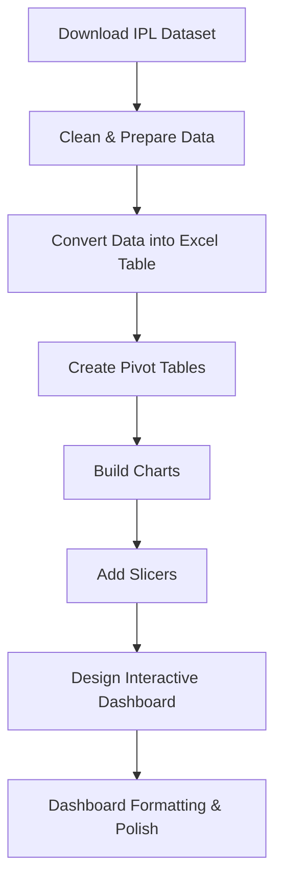

<div align="center">

# 📊 IPL Excel Dashboard Project
### End-to-End Excel Dashboard for Data Analysts
---

### 🚀 Build Professional Interactive Dashboards Using Excel

</div>

---

# 📌 Project Overview

This project demonstrates how to build a **fully interactive Excel Dashboard** using IPL (Indian Premier League) data.

The dashboard helps analyze:

- 🏏 Team performance
- 🎯 Toss decisions
- 📈 Match-winning patterns
- 🏟️ Top stadium venues
- 📊 Season-wise IPL insights

The project is designed specifically for:

✅ Aspiring Data Analysts  
✅ Excel Learners  
✅ Portfolio Projects  
✅ Dashboard Practice  
✅ Interview Preparation

---

# 🎯 Dashboard Features

## 🔹 Interactive Season Filters
Use **Slicers** to dynamically filter IPL seasons from **2008–2018**.

✔ View single season stats  
✔ Compare multiple seasons  
✔ Dynamic dashboard updates

---

## 🔹 Match Win Analysis
Analyze matches won based on:

- Bat First
- Field First

### 📊 Visualization Used
- Pivot Charts
- Stacked Column Charts

---

## 🔹 Toss Decision Insights
Understand how toss decisions affect match outcomes.

### 📈 Dashboard Includes
- Wins after batting first
- Wins after fielding first
- Percentage-based comparisons

### 📊 Visualization Used
- Donut Charts
- Pivot Tables

---

## 🔹 Top 10 IPL Venues
Identify stadiums hosting the highest number of matches.

### 🏟️ Example Venues
- Chinnaswamy Stadium
- Eden Gardens
- Wankhede Stadium

### 📊 Visualization Used
- Stacked Bar Charts
- Top 10 Pivot Filters

---

# 🧠 Excel Skills Demonstrated

| Skill | Description |
|---|---|
| 📌 Pivot Tables | Data summarization & aggregation |
| 📌 Pivot Charts | Interactive data visualization |
| 📌 Slicers | Dynamic dashboard filtering |
| 📌 Flash Fill (`Ctrl + E`) | Automated text formatting |
| 📌 Excel Tables (`Ctrl + T`) | Structured datasets |
| 📌 Sorting & Filtering | Better analytical insights |
| 📌 Donut Charts | Percentage-based analysis |
| 📌 Dashboard Formatting | Professional reporting UI |

---

# 🛠️ Tools & Technologies

<div align="center">

| Tool | Purpose |
|---|---|
| Microsoft Excel | Dashboard Development |
| Pivot Tables | Data Aggregation |
| Pivot Charts | Visualization |
| Slicers | Interactivity |
| CSV Dataset | Data Source |

</div>

---

# 📂 Project Workflow



---

# 🔍 Data Cleaning Process

The project includes several preprocessing steps:

### ✅ Extract Year from Date
Using Excel's `YEAR()` function.

```excel
=YEAR(A2)
```

---

### ✅ Generate Season Labels
Using Flash Fill (`Ctrl + E`):

```text
IPL 2008
IPL 2009
IPL 2010
```

---

### ✅ Convert Dataset into Structured Table

Shortcut Used:

```text
Ctrl + T
```

Benefits:
- Dynamic ranges
- Easier filtering
- Better Pivot Table management

---

# 📈 Dashboard Insights

## 🏆 Team Performance Analysis
- Mumbai Indians had the highest wins overall
- Comparison of batting-first vs fielding-first victories

---

## 🎯 Toss Impact Analysis
- Teams choosing to field first won more matches overall
- Toss decisions significantly influenced outcomes

---

## 🏟️ Venue Analysis
Top stadiums hosted the majority of IPL matches.

Key findings:
- Chinnaswamy Stadium
- Eden Gardens
- Wankhede Stadium

---

# 📸 Dashboard Preview

## 🖥️ Main Dashboard
```md
Add Screenshot Here
```

```md

```

---

## 📊 Pivot Table Example
```md

```

---

## 📈 Charts Preview
```md

```

---

# 🚀 Learning Outcomes

After completing this project, you will be able to:

✅ Build professional Excel dashboards  
✅ Create interactive reports  
✅ Use Pivot Tables efficiently  
✅ Design dynamic charts  
✅ Perform business data analysis  
✅ Present insights visually  
✅ Improve Excel reporting skills

---

# 💼 Ideal For

This project is perfect for:

- 📊 Data Analyst Portfolio
- 📚 Excel Practice
- 🎓 Students & Beginners
- 💼 Interview Preparation
- 📈 Business Reporting Projects

---

# ⭐ Key Takeaways

✔ Excel can create professional dashboards without coding  
✔ Pivot Tables are essential for data analysis  
✔ Slicers make reports interactive  
✔ Proper formatting improves dashboard readability  
✔ Dashboard storytelling helps business decision-making

---

# 🤝 Contributing

Contributions are welcome!

If you'd like to improve the dashboard or add new features:

1. Fork the repository
2. Create a new branch
3. Commit your changes
4. Submit a Pull Request


# 🌟 If you found this project useful, don't forget to star the repository!

### Made with ❤️ using Microsoft Excel

</div>

---

Learn more on Glasp: https://glasp.co/reader?url=https://www.youtube.com/watch?v=wuYaTSHKx9k

